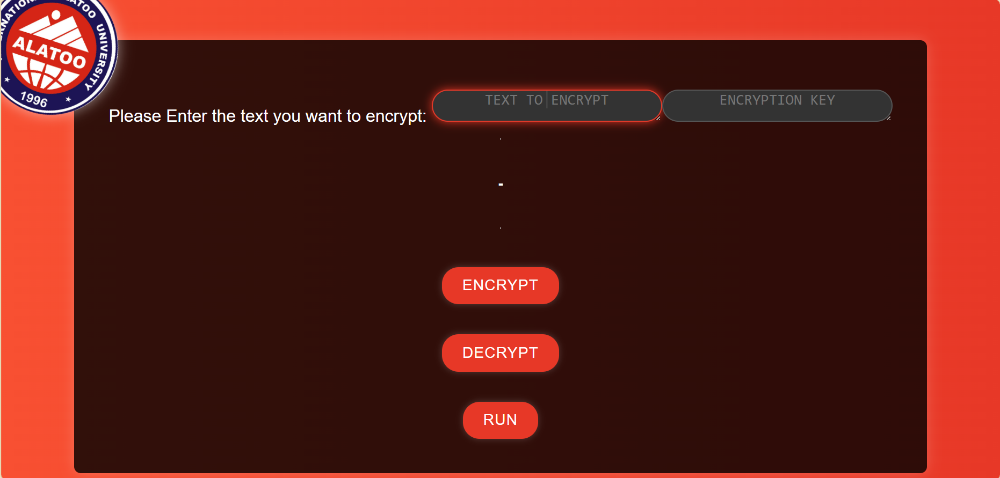

React-Project

- Name and Surname: Nuriza Paishan kyzy
- Front-end Development 

## Description Of The Project

A React app with single TextArea Component. The textarea is wrapped into a component which changes state and reacts to typing, encoding and decoding.

> [Deployed App](https://nuriza.nazim.tk)

Final result:

### The Algorithm
I have used Caesar Cipher to encode and decode the given text. Encoding: each letter of a given text is replaced by a letter with a fixed number of positions down the alphabet.
For Example: encrypt and run 

text = NURIZA

encryption code = 5

output --> szwnef

We use the given shift in the opposite direction to decrypt the original text.

## Animated AIU Logo

 

